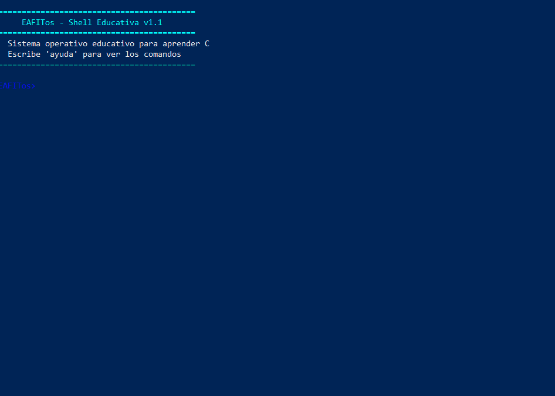

<div align="center">

# eafitOS

**A powerful educational operating system featuring an interactive shell built in C.**  
Explore system programming fundamentals, process management, and data structures through hands-on implementation of Unix-like commands with modern UI enhancements.

<br/>



<br/>

    

</div>

---

## Descripción del Proyecto

EAFITos es un proyecto académico que implementa una shell interactiva (REPL) con comandos personalizados para gestión de archivos, cálculos matemáticos, historial de comandos y más. El sistema está diseñado siguiendo principios de programación modular en C, con una arquitectura clara que separa las responsabilidades en distintos módulos.

### Alcance Implementado

- ✅ **Shell interactiva** con bucle REPL (Read-Eval-Print-Loop) completo
- ✅ **10 comandos funcionales** con sintaxis Unix-like (list, read, create, remove, stats, time, calc, history, help, exit)
- ✅ **Sistema de historial** con buffer circular para últimos 10 comandos (aritmética modular)
- ✅ **Interfaz de usuario mejorada** con códigos ANSI para colores y formato profesional
- ✅ **Arquitectura modular** separando core, comandos y utilidades (principios SOLID)
- ✅ **Funciones helper reutilizables** para formateo de archivos, validación y manejo de errores
- ✅ **Confirmaciones de seguridad** en comandos destructivos (remove con preview interactivo)
- ✅ **Documentación completa** con Doxygen, README profesional y CHANGELOG versionado

## Comandos Disponibles

| Comando | Argumentos | Descripción | Ejemplo |
| :--- | :--- | :--- | :--- |
| `list` | Ninguno | Lista los archivos del directorio actual. | `list` |
| `read` | `<file>` | Muestra el contenido de un archivo de texto. | `read README.md` |
| `create` | `<file>` | Crea un archivo vacío. | `create test.txt` |
| `remove` | `<file>` | Elimina un archivo con confirmación interactiva. | `remove test.txt` |
| `stats` | `<file>` | Muestra información detallada (tamaño, fechas, permisos). | `stats test.txt` |
| `time` | Ninguno | Muestra la fecha y hora actual del sistema. | `time` |
| `calc` | `<n1> <op> <n2>` | Realiza operaciones aritméticas (+, -, *, /). | `calc 10 * 2.5` |
| `history` | Ninguno | Muestra los últimos 10 comandos ejecutados. | `history` |
| `help` | Ninguno | Muestra la lista de comandos disponibles con formato. | `help` |
| `exit` | Ninguno | Termina la sesión de EAFITos. | `exit` |


## Características Técnicas

### Sistema de Registro de Comandos

El proyecto utiliza un sistema basado en arreglos de punteros a función para registrar y ejecutar comandos dinámicamente. Cada comando se implementa como una función `void cmd_nombre(char **args)` y se registra en `shell_loop.c`.

### Buffer Circular para Historial

El comando `history` utiliza una implementación eficiente de buffer circular que mantiene los últimos 10 comandos sin necesidad de desplazar elementos en memoria. Usa aritmética modular para reescribir posiciones antiguas.

### Sistema de UI con Colores ANSI

El módulo `ui.c` proporciona funciones helper para imprimir mensajes con colores:
- **Errores** en rojo
- **Éxitos** en verde
- **Información** en cyan
- **Prompt** en azul con negrita
- **Separadores** para organizar visualmente la salida

### Inspección de Metadatos con stat()

El comando `stats` utiliza la syscall POSIX `stat()` para obtener información completa de archivos:
- Tamaño con formato legible (bytes, KB, MB, GB)
- Tipo de archivo (regular, directorio, enlace simbólico, etc.)
- Permisos en notación octal (ej: 0644, 0755)
- Número de inodo y enlaces duros
- Fechas: última modificación, último acceso, cambio de metadatos

### Funciones Helper Reutilizables (utils.h)

El módulo `helpers.c` proporciona funciones comunes siguiendo el principio DRY:
- **`formatear_tamano()`**: Convierte bytes a formato legible (KB/MB/GB) automáticamente
- **`formatear_fecha()`**: Formatea timestamps UNIX a formato dd/mm/yyyy hh:mm:ss
- **`validar_argumento()`**: Valida argumentos de comandos con mensajes de error consistentes
- **`archivo_existe()`**: Verifica existencia de archivos usando stat() eficientemente

### Confirmaciones de Seguridad

El comando `remove` implementa confirmación interactiva antes de operaciones destructivas:
- Muestra información del archivo (tamaño, fecha de modificación)
- Requiere confirmación explícita (y/n)
- Usa colores para destacar advertencias
- Previene eliminaciones accidentales

### Manejo Robusto de Errores

- Validación de argumentos en todos los comandos
- Mensajes de error descriptivos con `perror()` para errores del sistema
- Verificación de valores de retorno de syscalls (fopen, stat, remove, etc.)
- Códigos de color para distinguir errores, éxitos e información


## Inicio Rápido

### Compilación

Limpiar la build pasada
```bash
make clean
```

Crear nueva build
```bash
make
```

### Ejecución

```bash
make run
# O directamente:
./build/sistema_os
```

### Limpieza de Archivos de Compilación

```bash
make clean
```

## Estructura del Proyecto

```
eafitOS/
├── src/
│   ├── core/               # Núcleo del sistema
│   │   ├── main.c          # Punto de entrada
│   │   ├── shell_loop.c    # REPL y registro de comandos
│   │   └── parser.c        # Lectura y parsing de entrada
│   ├── commands/           # Implementación de comandos
│   │   ├── basic_commands.c
│   │   ├── file_commands.c
│   │   ├── system_commands.c
│   │   └── advanced_commands.c
│   └── utils/              # Utilidades compartidas
│       ├── helpers.c
│       ├── error_handler.c
│       ├── memory_manager.c
│       └── ui.c            # Sistema de colores y formato
├── include/                # Archivos de cabecera (.h)
├── build/                  # Archivos compilados
├── docs/                   # Documentación adicional
└── tests/                  # Pruebas unitarias e integración
```


## Documentación

Para generar la documentación técnica con Doxygen:

```bash
doxygen Doxyfile
```

Luego abre `docs/html/index.html` en tu navegador.

## Equipo de Desarrollo

"One Man Operation :D"
- **Sebastian Salazar Osorio** - Desarrollo principal, arquitectura, testeo y documentación.

## Notas de Desarrollo

- El proyecto está optimizado para compilación en Linux/WSL con GCC
- Se utiliza aritmética modular en el historial para eficiencia
- La función `(void)variable;` se usa para suprimir warnings de variables no utilizadas
- Todos los comentarios siguen formato Doxygen: `/** @brief Descripción */`

## Licencia

Este proyecto es de código abierto bajo la licencia MIT. Ver archivo `LICENSE` para más detalles.

---

**Curso**: Sistemas Operativos  
**Universidad**: EAFIT  
**Profesor**: Edison Valencia
**Fecha**: Febrero 2026
